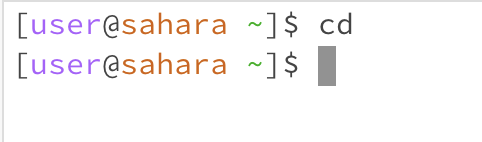
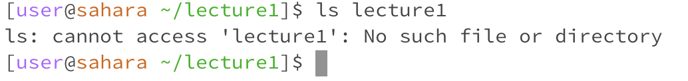
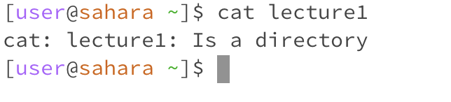
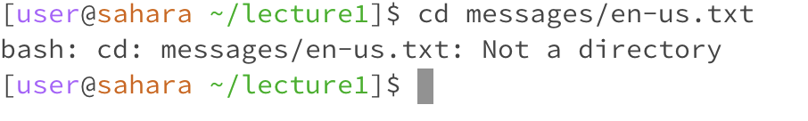
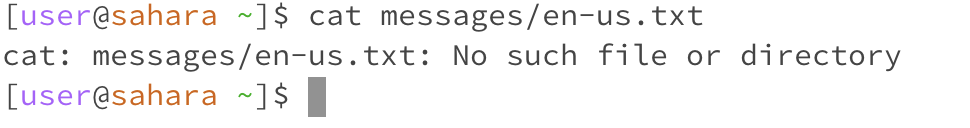

**Lab Report 1**

Here are examples of the commands "cd", "ls", and "cat" with no arguments: 

- working directory:/home/lecture1
- no argument meant that no ouput
- no error

- working directory: /home/lecture1
- displays the contents within lecture1 including java files and .class files
- no error

- working directory: N/A
- no output because no argument, but does erase the directory 
- no error 

Here are examples of the commands "cd", "ls", and "cat" with a path to a directory as an argument:

- working directory: /home
- no output and lecture1 argument shifted the directory to /home/lecture1
- no error

- working directory: /home/lecture1
- says no such file or directory which seems faulty as it does exist
- error, supposed to read the contents of lecture 1

- working directory: /home
- confirms that lecture1 is a directory 
- no error

Here are examples of the commans "cd", "ls", and "cat" with a path to a file as an argument:

- working directory: /home/lecture1
- expected a directory but got a file instead which outputted an error
- file being passed as an argument resulted in error

- working directory: /home/lecture1
- outputted messages/en-us.txt, displayed the file of messages/en-us.txt
- no error

- working directory: /home
- outputted no such file or directory, seems faulty as well as I thought it would display the contents of the file 
- error, did not locate the file or directory 
